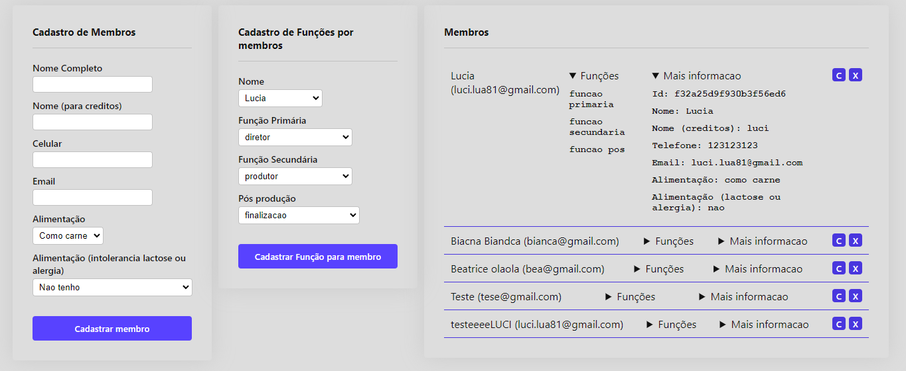

# 📽️ Member Registration
#### CRUD system for managing members in an audiovisual production team

---

### 🖼️ Preview:



### 🏗️ Features:

##### Backend:

- [x] Create member (C)

- [x] Read members file (R)

- [ ] Update member (U)

- [ ] Delete member (D)


#### Frontend:

- [x] Form: Create member

- [x] Form: Insert function for member (update)

- [x] Show members in table

- [ ] Button: Delete member (created but doesn't work yet)

- [ ] Button: Modify member (created but doesn't work yet)

- [ ] Component [header] - With toggle between forms

- [ ] Table of roles and assignments


### 🔥 Start:


> clone this repository
```bash
git clone https://github.com/LuciLua/cadastro-membros
```

> install the dependencies
```bash
    yarn
```

> start the server (backend)
```bash
    yarn server
```

> start the server (frontend) - it doesn't work yet - (use vs code's live server or use the website for now: https://cadastro-members.vercel.app/)
```bash
    yarn start
```

